# Olá, Seja bem-vindo!

### :computer: Eu sou o Raphael, sou formado em Análise e Desenvolvimento de Sistemas.
### Tenho conhecimento em Python, SQL, PHP, Java, JavaScript, CSS, Bootstrap, WordPress, Power BI, Git e Github. :computer:
 
 

 

 

